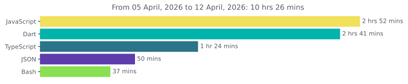

<div id="header" align="center">
  
  <h1 align="center">
    👋 Hello, I'm Irwan!
    <br/>
    <a href="https://www.irwanx.my.id">
      
    </a>
    <a href="https://www.linkedin.com/in/irwan-xyans/">
      
    </a>
  </h1>
</div>

---

## 💫 About Me


```javascript
class Irwanx {
  constructor() {
    this.name = "Irwan";
    this.username = "irwanx";
    this.location = "Magelang, Central Java, Indonesia 🇮🇩";
    this.education = "Information Systems @ STMIK Bina Patria";
    this.portfolio = "https://www.irwanx.my.id";
    this.interests = [
      "API Development",
      "Backend Engineering",
      "System Architecture",
      "DevOps",
      "Open Source"
    ];
    this.currentFocus = [
      "Next.js",
      "TypeScript",
      "System Design",
      "Cloud & CI/CD"
    ];
  }

  getExpertise() {
    return {
      languages: ["JavaScript", "TypeScript", "PHP", "Python"],
      frontend: ["HTML", "CSS", "TailwindCSS", "React.js", "Next.js"],
      backend: ["Express.js", "Flask", "PHP"],
      devTools: ["Git", "Docker", "VS Code", "Postman"],
      specialties: [
        "Full Stack Development",
        "REST API Design",
        "Web Automation",
        "Clean Code"
      ]
    };
  }

  currentStatus() {
    return "🚀 Building real-world projects, learning DevOps, and crafting better APIs 🔥";
  }
}
```

---

## 📫 Get in Touch

[](mailto:irwan@dobda.id)
[](https://www.linkedin.com/in/irwan-xyans/)
[](https://instagram.com/irwan_x_yans/)
[](https://wa.me/628882611841)

---

## 💻 Tech Stack
### 🚀 Primary Tech Stack


<details>
  <summary>🧰 See More</summary>

<br/>

## 💡 Languages & Frameworks


### ⚛️ Frontend Libraries


### 🎨 UI & Styling


### 🧠 Machine Learning


### 🗃️ Databases & Backend Tools


### ☁️ Hosting & Infrastructure


### 🧪 Dev Tools & CI/CD


### 🧩 Design & Prototyping


</details>

## 📊 GitHub Stats
<div align="center" style="display: flex; flex-wrap: wrap; justify-content: center; gap: 4px;">
    
    
    
    
    
</div>

---

## 🕒 Coding Activity (via WakaTime)

📊 **Yearly Development Breakdown**

<!--START_SECTION:waka-->

```rust
From: 30 January 2024 - To: 02 January 2026

Total Time: 1,207 hrs 5 mins

TypeScript         341 hrs 7 mins  >>>>>>>------------------   28.01 %
JavaScript         330 hrs 6 mins  >>>>>>>------------------   27.11 %
PHP                315 hrs 10 mins >>>>>>-------------------   25.88 %
Python             43 hrs 32 mins  >------------------------   03.58 %
HTML               33 hrs 26 mins  >------------------------   02.75 %
EJS                25 hrs 39 mins  >------------------------   02.11 %
CSS                24 hrs 36 mins  >------------------------   02.02 %
Dart               13 hrs 6 mins   -------------------------   01.08 %
Other              10 hrs 42 mins  -------------------------   00.88 %
```

<!--END_SECTION:waka-->

---

📊 **Weekly Development Breakdown**



---

## 👁️ Visitor Count


---

## 📜 Quote of the Day

<!-- START_QUOTE -->
> "Takan mulia kau menunggu permintaan maaf. Takan hina kau meminta maaf terlebih dahulu." - *Fiersa Besari*
<!-- END_QUOTE -->
